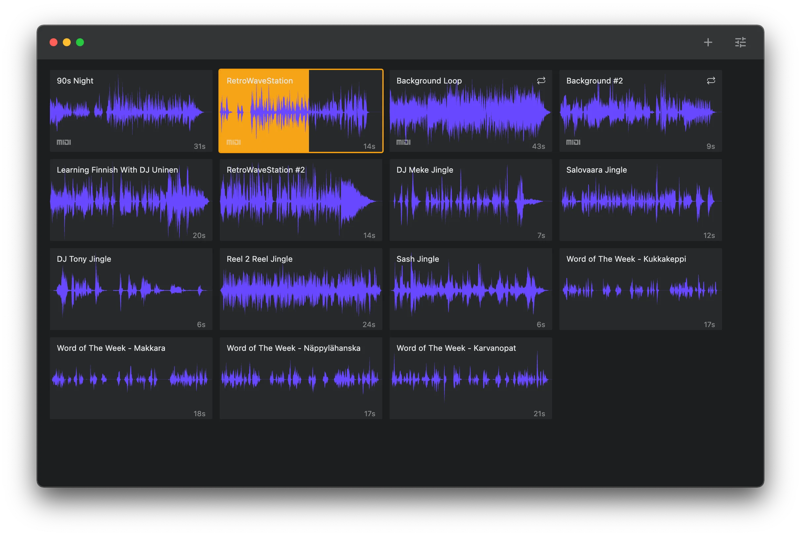
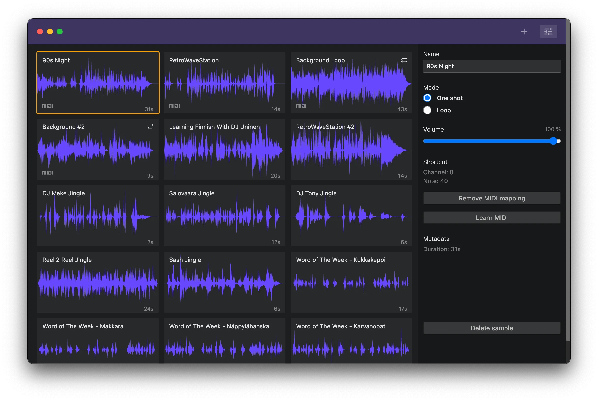

# Slipmat Soundboard

Simple soundboard app with MIDI control.

## Features

- Supported file formats: aiff, aac, flac, mp3, m4a, wav
- Add samples by drag & drop or via native file dialog
- Automatic waveform generation for samples
- Samples can be marked as oneshots or loops
- Triggering via MIDI note on or with mouse

Planned:

- Windows and Linux binaries
- Keyboard hotkeys
- More than one sample board
- Automatic metadata extraction
- More control over sample playing / triggering
- Exposing a mobile + tablet-friendly server to local network
- Deep integration with Slipmat.io v3 platform

## Status

This project is very young but already usable if it happens to fit your needs. There are a ton of features still missing and the development and testing has only been done on macOS so plenty of work to be done.

## Known Issues

- The waveform generation is currently _very_ unefficient. It's also designed for short (<60s) samples only. YMMV.
- The MIDI learn feature works but there's no error handling for overlapping messages. Hitting `Command-R` will reload the window and reset the MIDI connection if it goes wonky.
- The samples and the user data is currently stored in `~/Application Support/Soundboard/`. In the future the plan is to allow storing samples in Slipmat cloud for easier use on multiple hosts.

## Development

#### Install Dependencies

`yarn`

#### Start Development Environment

`yarn dev`

#### Run Tests

`yarn test`
### Project Structure

The entire source code of the program is divided into three modules (packages) that are bundled each independently:
- [`packages/main`](packages/main): 
Electron [**main script**](https://www.electronjs.org/docs/tutorial/quick-start#create-the-main-script-file).
- [`packages/preload`](packages/preload): 
Used in `BrowserWindow.webPreferences.preload`. See [Checklist: Security Recommendations](https://www.electronjs.org/docs/tutorial/security#2-do-not-enable-nodejs-integration-for-remote-content).
- [`packages/renderer`](packages/renderer): 
Electron [**web page**](https://www.electronjs.org/docs/tutorial/quick-start#create-a-web-page).

### Configuration

- Create following environment variables (in `.env` in development and as CI secrets for GH actions):
  - `APPLE_ID`: your developer Apple ID
  - `APPLE_APP_SPECIFIC_PASSWORD`: app specific password for signing and notarization ([create here](https://appleid.apple.com/account/home))
  - `CSC_KEY_PASSWORD`: your password for the CSC key (exported .p12 cert)
  - `CSC_LINK`: base64 hash of your .p12 cert (create w/ `openssl base64 -in my-cert.p12`)
- Add needed [App Sandbox Entitlement Keys](https://developer.apple.com/library/archive/documentation/Miscellaneous/Reference/EntitlementKeyReference/Chapters/EnablingAppSandbox.html) in `buildResources/entitlements.mac.plist`

## Contributing

Contributions are welcome! Please follow the [code of conduct](https://www.contributor-covenant.org/version/2/0/code_of_conduct/) when interacting with others.
